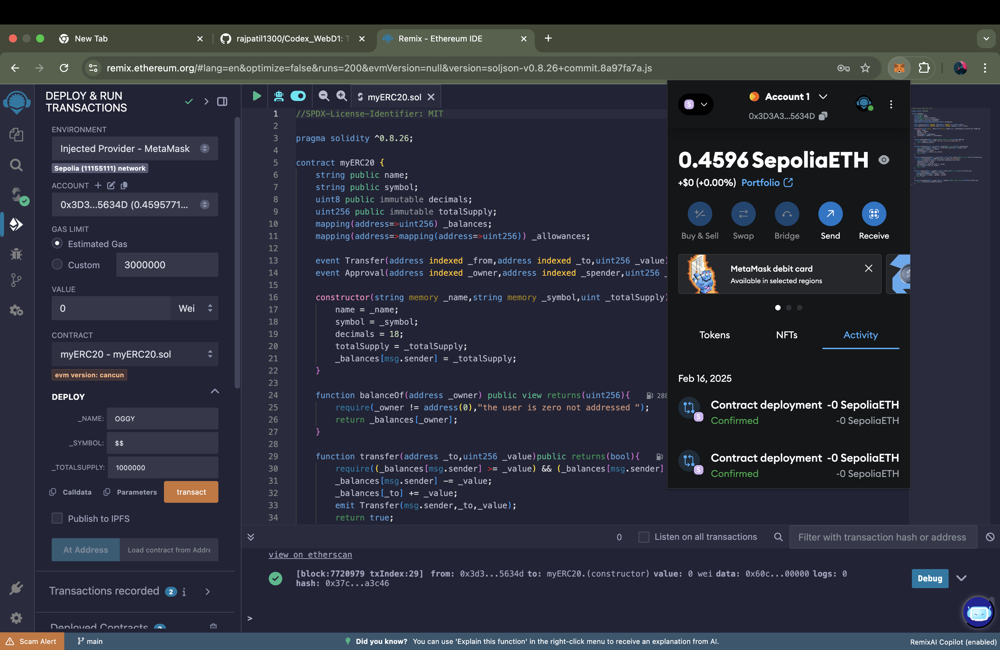

# MyERC20 Smart Contract

## Overview
`myERC20` is a basic ERC-20 token implementation that includes functions for transferring tokens, approving allowances, and querying balances. It follows the fundamental ERC-20 standard.

## Prerequisites
Before deploying the contract, ensure you have the following:
- **Google Chrome** or another browser that supports MetaMask.
- **MetaMask Wallet** installed and configured.
- **Sepolia ETH** in your wallet (can be obtained from a faucet).
- **Remix IDE** (https://remix.ethereum.org/)

## Steps to Deploy on Remix IDE

### 1. Open Remix IDE
- Visit [Remix Ethereum](https://remix.ethereum.org/).
- Click on the **File Explorers** tab and create a new file named `myERC20.sol`.
- Copy and paste the `myERC20` smart contract code into this file.

### 2. Compile the Smart Contract
- Navigate to the **Solidity Compiler** tab.
- Select the appropriate compiler version (`0.8.26`).
- Click on **Compile myERC20.sol**.

### 3. Connect MetaMask to Remix
- Open MetaMask and switch to the **Sepolia test network**.
- In Remix, go to the **Deploy & Run Transactions** tab.
- Under "Environment", select **Injected Provider - MetaMask**.
- Accept the MetaMask connection request.

### 4. Deploy the Contract
- Under the "Deploy" section in Remix, enter the constructor parameters:
  - `_name` (e.g., "Doggy")
  - `_symbol` (e.g., "D$$")
  - `_totalSupply` (e.g., `1000000` for 1 million tokens)
- Click **Deploy**.
- Confirm the transaction in MetaMask.
- Wait for confirmation; the contract will be deployed.

#### Screenshots

### 5. Interact with the Contract
Once deployed, you can interact with the contract using the Remix UI:
- **balanceOf(address)**: Check the balance of an address.
- **transfer(address, uint256)**: Send tokens to another address.
- **approve(address, uint256)**: Allow another account to spend tokens.
- **transferFrom(address, address, uint256)**: Transfer tokens on behalf of an owner.

## Learnings
Deploying and interacting with an ERC-20 token provides valuable insights into Ethereum smart contracts:
- Gaining deeper knowledge about Ethereum tokens, Solidity, and MetaMask.
- Understanding Solidity syntax and contract structure.
- Learning how ERC-20 tokens work, including balances and allowances.
- Gaining experience with Remix IDE and MetaMask for smart contract deployment.
- Exploring test networks like Sepolia for risk-free experimentation.
